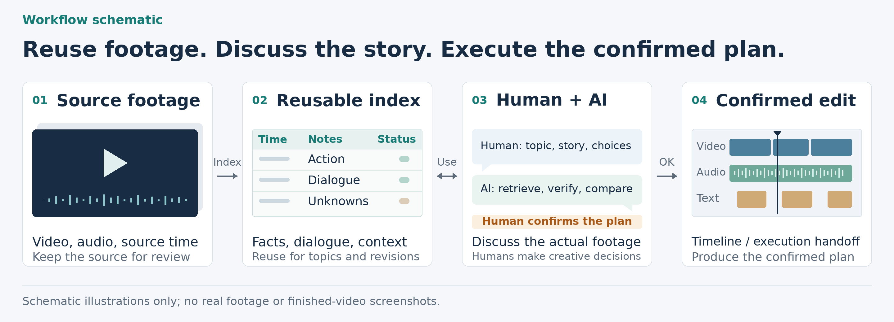

# Long Video Remix

[中文](README.md) | **English**

Turn long videos into a searchable index you can trace back to the source. Work with AI to find topics, shape the story, and revise the plan, then hand the confirmed plan over for execution.



For **MCNs, directors, and content editors** who reuse long video footage, develop ideas through discussion, and produce different versions.

| Core value | How it works |
|---|---|
| **Lower-cost reuse** | Broad builds a global content map; creative discussion, retrieval, and revision reuse the data, while Detail focuses on verifying selected regions |
| **Rich structure** | Preserves facts for each sampled frame, action changes, dialogue / speaker evidence, context, emotional cues, questions, unverified items, and source time |
| **Human creative control** | Two Direct stages: first decide what to tell, then decide exactly how to tell it once the evidence is complete; Execute implements confirmed decisions |
| **Checkable execution** | Binds evidence to source versions and checks edit boundaries, dialogue protection, authorized source ranges and order, timelines, layered caches, and export audits |

The goal is to reduce the cost of repeatedly interpreting raw multimodal material. Frame extraction, ASR, targeted review, and GPU rendering still require resources. Actual costs depend on the material, models, and tools; this project promises no fixed percentage reduction.

Use only source material you have the right to use.

For version updates, validation results, and installation, see [Release notes](RELEASE_NOTES.md) · [CHANGELOG](CHANGELOG.md) · [Installation and updates](INSTALL.md) · [Historical QA](docs/qa/README.md).

## Quick start

For a first local installation, choose the command for your tool. For an existing installation directory, see [Installation and updates](INSTALL.md).

```sh
# Claude Code
mkdir -p ~/.claude/skills && git clone https://github.com/hazelliuliu1823-cloud/long-video-remix.git ~/.claude/skills/long-video-remix

# Codex
mkdir -p ~/.agents/skills && git clone https://github.com/hazelliuliu1823-cloud/long-video-remix.git ~/.agents/skills/long-video-remix
```

1. Install the complete folder, copy `assets/project-template.json` to create a separate project, and register sources and available models / video tools.
2. Complete Broad's formal observation layer and Content Map. If you only need structured analysis, deliver at this point; later editing can reuse the results.
3. A human / Director defines the narrative spine. Detail verifies the selected regions and delivers real keyframes and a standalone handoff. Direct 2 then confirms the Execution Package (plan + production reference) and machine-readable authorization.
4. Run static validation and compilation. The rendering adapter checks authorization before consuming the manifest:

```sh
python3 scripts/validate_project.py PROJECT
python3 scripts/compile_render_manifest.py PROJECT
python3 scripts/check_render_authorization.py PROJECT PROJECT/render-manifest.json
```

Raw audiovisual processing and actual rendering are handled by the models, video MCP, FFmpeg, or other adapters available in the current environment. The bundled scripts prepare authorization records, run static checks, compile timelines, and audit exports. Connect a renderer through the [MCP adapter contract](references/mcp-adapter.md).

## Workflow

| Stage | Outputs and decisions |
|---|---|
| Broad Structure → Structured Observation Layer → Content Map | Global observation tables and scene / action / question indexes, preserving coverage and gaps |
| Direct 1 · Narrative Direction | A human / Director determines the narrative spine, candidate regions, and questions to verify |
| Directed Deep / Detail Structure + Edit Boundary | Verifies continuous audiovisual material, surrounding context, counterevidence, and editable ranges; delivers real keyframes and a standalone handoff with the evidence; returns to Direct 1 if evidence is insufficient |
| Direct 2 · Execution Package | Confirms the plan + production reference: events, order, specific audio / text / transitions, rules for applying one or two style samples across the video, and allowed adjustments |
| Execute → Render / QA | Produces the video from the complete execution package and machine-readable authorization, then performs technical checks, playback review, and Reference Compliance |

## How rich structure reliably reaches execution

A fixed information baseline preserves facts, derived interpretations, and unknowns. Source-time tags let every judgment be traced back to the original footage, while incremental saves and recovery reduce repeated scanning. Execution integrity binds adopted evidence, boundaries, reviews, and independent source-audio tracks to current source versions, and checks actual ranges and order against Direct 2.

Drafts that are not ready may only be compiled into non-renderable manifests by explicitly using `--planning`. Audio continuity checks protect dialogue and audio tails. J/L-cuts or creative truncation require specific confirmed grounds. Results continue to distinguish technical success from final listening and viewing approval.

For engineering fields and migration, see the [Execution integrity contract](references/execution-integrity.md). A runnable example is available in `examples/synthetic-ready` (synthetic records, no real media). The same structured layer can also support [Content performance analysis](examples/content-performance-analysis.md).

<details>
<summary><strong>Full method, Structure forms, Direct responsibilities, and engineering notes</strong></summary>

## Why Structure is worth doing on its own

Video, images, subtitles / original audio, people, actions, scenes, and context are costly multimodal information. Structure compresses them into searchable, sortable, traceable tables and text, such as `frame-observations.csv`, scene / overview records, and `content-map.md`. People, Directors, or other Skills can consume this compact data first, rather than reloading the original videos, nine-frame grids, and large image collections every time.

This produces a straightforward change:

| Before | After Structure |
|---|---|
| Analyze each video again, one by one | Turn multiple videos into a unified structured data layer |
| Reopen the video to inspect a time point | Directly locate the people, actions, dialogue, background, and content description at that timecode |
| Repeatedly read the same multimodal material for different tasks | Reuse the same structured results for editing, content research, performance review, and retrieval |
| Spend substantial context on watching everything again | Concentrate costly multimodal reading on the regions that need deeper analysis |

## Why Execute is also central

Structure makes source material understandable and reusable. Producing a video still requires turning a confirmed creative plan into a timeline that **preserves evidence and protected ranges, can be rendered, and can be checked**.

Execute further refines material already verified by Directed Deep Structure into:

- verified units and necessary surrounding context;
- `context_ranges` / `protected_ranges`, preventing removal of essential meaning or actions;
- `edit-boundaries.csv`: separates the end of content from a genuinely safe cut, recording audio tails, action / reaction closure, preferred in/out, safe windows, must-keep ranges, and cut risk;
- an assembly timeline and an output timeline;
- hard cuts / xfade, audio tracks, text tracks, and chapter cards;
- `render-manifest.json`;
- full decoding after export, frame-count / duration checks, near-silence scans, comparison images for every join, and final QA.

This repository therefore does not stop at structured analysis and leave you to work out the edit yourself. **Structure and Execute provide stable capabilities at both ends. Direct provides two creative decision points that require human participation: first confirm the narrative spine, then confirm the final execution plan.**

## A concrete example: from analyzing videos to analyzing content

Suppose you have 500 published short videos, along with playback curves, viewing duration, drop-off, or engagement data.

Previously, you might only learn:

> Retention rises at 12 seconds in video A; viewers begin leaving at 8 seconds in video B; video C has a higher completion rate.

What you really want to know is: **what viewers actually saw at that time point.**

After Structure, each analyzed time point can be mapped to structured content: people, actions, expressions / gaze, spatial relationships, dialogue, on-screen text, scene background, and narrative function. Audience behavior data can then be linked directly to content nodes:

| Time point | Structured content | Content type | Audience behavior |
|---|---|---|---|
| 00:08 | Two people argue; one turns and leaves | Conflict / action change | Retention rises |
| 00:12 | A close-up reaction with no dialogue | Character reaction | Replays increase |
| 00:19 | A long stretch of explanatory dialogue | Exposition | Drop-off increases |
| 00:27 | Information planted earlier pays off | Narrative payoff | Retention rises again |

The analysis can then move beyond which video performs well to ask:

- Which kinds of images are more likely to hold attention?
- Which character actions often correspond to replays?
- Before viewers leave, is there usually long dialogue, a static image, or a decline in information density?
- Does a structure such as conflict → reaction → payoff perform consistently across videos?
- Can we retrieve every segment with character silence + a close-up reaction and compare their performance?

**Structure's value is turning video from a multimodal object that is difficult to compute over and combine into a data layer that can be searched, filtered, joined, compared, and used for further creation.**

The same structured results support editing, content review, audience behavior analysis, comparisons across videos, research, retrieval, and other AI workflows. For a fuller example, see [`examples/content-performance-analysis.md`](examples/content-performance-analysis.md).

## Suitable uses

This method suits video work where source material is long and needs repeated interpretation and reuse: drama / variety shows / interviews / documentaries / courses / event recordings, as well as performance reviews of published content.

It is especially useful when:

- there is too much material to understand reliably through a single summary;
- the same videos will be reused for editing, research, retrieval, or analysis;
- creative direction needs human participation instead of a single black-box generation;
- only a small number of candidate segments justify dense multimodal observation;
- content judgments ultimately need to become stable timelines, transitions, audio tracks, and QA.

## Why two Structure passes

Scanning an entire long video at frame-level detail in one pass is expensive and can waste computation before creative direction is established. This workflow uses two Structure passes with different goals:

- **First pass, Broad Structure: prioritize coverage.** Review all source material at a lower sampling density and compress the results into a reusable structured working layer;
- **Second pass, Directed Deep Structure: prioritize completeness.** Once the script direction is confirmed, return only to selected regions to add dense visual observation, original audio, surrounding context, and counterevidence.

Costly multimodal observation is therefore concentrated in a small number of valuable regions, while creative discussion, retrieval, and analysis across videos can work from already structured data wherever possible.

## Structure is a reusable working layer

This structured data layer does not replace original evidence. It lets subsequent work proceed without starting again from the original video. People and other models can quickly browse, filter, sort, search, and cite it.

It addresses three main problems:

- **Reduce repeated multimodal reading**: later Direct stages do not need to reload original videos, nine-frame grids, or large image collections into context for every creative discussion;
- **Reduce context load during creative work**: people, Directors, or other Skills can combine and assess `frame-observations.csv`, scene / overview records, and `content-map.md` directly;
- **Concentrate costly computation on selected regions**: only passages involved in the confirmed script return to the original footage for Directed Deep Structure, with dense reading of visuals, original audio, and surrounding context.

Original evidence is retained. All structured records preserve trace-back paths such as `frame_id`, `scene_id`, timecodes, and evidence refs, so work can return to the source material whenever needed.

## What Structure can do

Broad Structure can begin before a topic is defined. Typical outputs include:

- source material and version registration;
- visual sampling and subtitle / transcript coverage across the full duration;
- **Frame Observation Index**: one row per analyzed sampled frame, preserving frame ID / time / frame-end time in ms, visual facts, actions / states, emotional cues, space / background, motif tags, burned-in subtitles, **original-audio highlights and listening-verification status**, content description, changes from the previous frame, **topic judgment, confidence / evidence basis**, interpretations, and unknowns;
- **Action Node Candidates**: local windows with a default sampling density of 4fps around candidate changes in actions, gaze, positions, or object handoffs, preserving candidate start/end, the minimum viable unit, lip / speech cues, and relationship shifts;
- **Structure Q&A**: structured questions that affect understanding, answers, evidence, unverified items, and the next verification steps;
- scene-level event structure;
- traceable evidence for dialogue, people, locations, and actions;
- a source-order overview;
- a Content Map across scenes;
- navigation for relationship changes, recurring clues, key objects, and silent interactions;
- coverage and unknowns, distinguishing sampled regions from regions verified through continuous audiovisual review.

Structure aims to turn a difficult-to-browse long video into a **source-material space that people and models can search again, combine, and trace back**, rather than simply summarizing its plot.

Broad Structure's formal delivery is therefore neither a nine-frame grid plus a summary nor a Content Map alone. It is a **textual, structured, searchable, traceable working data package**:

1. **Raw evidence**: sampled individual frames, nine-frame grids, subtitles / ASR, and original source locations;
2. **Structured Observation Layer (core delivery)**: `frames.jsonl` + human-readable `frame-observations.csv`, `action-node-candidates.csv`, and `structure-questions.csv`, plus scene / segment observations and `overview.md`;
3. **Creative navigation layer**: `content-map.md`, emotional / relationship cues, and usable boundaries built on the formal records above, allowing the first Director to determine Narrative Direction without reloading the original video.

Frame-by-frame here means **each analyzed / sampled frame**. It does not claim semantic analysis of every frame in a 25/30fps video.

With `deliverable=content_map`, work can formally end at this stage without proceeding to editing.

### Structure's minimum information baseline

Structure output must not collapse into a few summary sentences plus a Content Map. The basic observation layer is the shared foundation for later creative work, analysis, and Execute:

- every analyzed sampled frame must retain a structured record;
- `visual_facts`, actions / states, `motif_tags`, burned-in subtitles / visible text, `change_from_previous`, `content_description`, and `unknowns` must be explicit; use `none` / `unknown` / `not_applicable` even when there is no content;
- action-change candidates must enter a separate action-node table with a local 4fps window or an explicit exception reason;
- questions that affect understanding must enter the Q&A table, preserving evidence and unverified items;
- the overview, Content Map, final copy, or editing suggestions must build on these basic records and cannot replace them.

This constraint ensures Structure becomes a reusable data layer, rather than leaving only a summary that cannot be examined in detail after each task.

## Why Direct happens twice

Direct is external by default and is usually best carried out in an **independent research / directing workspace**. It does not mix topic selection, evidence verification, and the final editing plan into one step; it appears on either side of the second Structure pass.

### Direct 1: Narrative Direction — “What are we telling?”

The first Director consumes Broad Structure's formal textual data: sampled-frame / segment observations, action nodes, Q&A, scene / overview, Content Map, emotional / relationship cues, usable source boundaries, and any necessary external research. Its task is to select:

- the core premise / viewing relationship;
- the Narrative Spine;
- candidate regions / scenes;
- questions for Detail Structure to answer;
- confirmed human judgments and items that must not change.

This step **does not require precise edit points and must not present structured clues as verified facts prematurely**. Use `assets/narrative-direction-template.md` or connect an existing research / directing document directly.

### Direct 2: Execution Package — “How do these materials tell the story?”

After Directed Deep / Detail Structure, the Director receives the complete evidence package for a second time: deep observations, original-audio / burned-in-subtitle verification, speaker adjudications, context / counterevidence, verified units, protected ranges, and evidence gaps. Only then is the final execution package formed. Its Editorial Execution Plan includes:

- which verified units are finally selected / excluded;
- their order and each segment's narrative function;
- dialogue / actions / reactions that must be retained in full;
- audio, text, transitions, pacing, and duration allocation;
- replaceable ranges and core expression that must not change.

Also deliver `execution-reference.md`: specific text styles / positions / display duration, visual treatment, audio / transitions, resources, and QA criteria. Usually one or two samples suffice to lock the style across the video; individual references are not required for every shot / subtitle. Detail's handoff already carries these output requirements, so switching models does not depend on the installed environment. See the [Complete delivery contract](references/execution-package.md). Use `assets/execution-plan-template.md` and `assets/execution-reference-template.md`. `assets/editorial-plan-template.md` remains as a combined template for older projects. By default, Execute only implements the plan confirmed by this second Director. **Final source-material selection belongs to Direct 2, not Execute.** If core evidence remains `pending / contradicted`, or either Direct stage is unconfirmed, the timeline cannot be marked `ready_for_render`.

## Why Directed Deep Structure is a separate stage

The first Content Map should not scan every region at frame-level detail for a particular topic. That would be costly and would make Structure commit to a topic prematurely.

Once the first Direct provides Narrative Direction, the system knows where to increase information density. The second pass still begins with **complete understanding of the material**, then makes editing judgments, rather than immediately marking cuts after finding candidates. Typical actions include:

- increase sampling from an overview at roughly ten-second intervals to one or two frames per second or continuous playback; key changes in actions / gaze / positions continue to use local windows at the default 4fps density;
- first create a **Detail Interval Card**: explain why the region requires detailed review, preceding context, current background, what follows, target questions, and its connection to the topic;
- create a **Deep Observation Index** for selected core regions, recording complete visual descriptions: people, positions / orientation, action chains, key visual changes, observable emotional cues / cautious emotional interpretations, expressions / gaze, distances between people, key objects, motif tags, shot size / composition;
- add a **content description**: what actually happens in the short segment, rather than just copying keywords or dialogue;
- add **scene and narrative background**: location / time / environment, the preceding event, and how the current moment came about;
- return from subtitle keywords to listening to the full conversation; distinguish burned-in subtitles / ASR / actual original audio, and record speakers, addressees, tone, pauses, environmental sound / music, and audio_verified; resolve ambiguity through frame-level lip / original-audio / subtitle / ASR evidence in **Speaker Adjudication**;
- expand beyond a single scene to fifteen to thirty seconds before and after it, or to the complete event when necessary, recording before_state / after_state;
- separate facts, interpretations, and unknowns; preserve `question_refs` / unverified items, and check counterevidence, gaps, incorrect causality, and spatiotemporal relationships against Narrative Direction;
- only then refine sufficiently understood core regions into units, context_ranges, protected_ranges, and executable editing judgments.

If evidence conflicts with Narrative Direction, the tool reports the problem and returns to Direct 1 for adjustment. If the evidence supports it, the complete Detailed Structure evidence package goes back to the Director to form the second Direct's Execution Package (Editorial Execution Plan + production reference), then proceeds to Execute.

## What Execute can do

At the start of Execute, creative direction is confirmed and relevant material has undergone a second targeted deep pass. Subsequent work includes:

- forming an executable edit plan;
- building an assembly timeline and an output timeline;
- handling hard cuts / xfade, audio tracks, text tracks, and chapter cards;
- using `protected_ranges` to prevent removal of essential meaning and actions;
- quantizing source events to the target fps using cumulative duration; the validator and compiler share the same output-coordinate calculation, avoiding drift from rounding each segment independently;
- including `source.time_mapping` in precise cache identity; mapping changes invalidate the relevant video / audio / final caches;
- compiling `render-manifest.json`;
- caching video, audio, and text outputs in separate layers;
- fully decoding exports and checking frame counts and presentation duration;
- scanning near-silence;
- automatically generating comparison images for every join;
- distinguishing technical checks, playback review, and final video approval.

The repository currently provides timeline compilation and export-audit scripts but **does not mandate one renderer**. You can pass `render-manifest.json` to FFmpeg, a video MCP, an editing-software adapter, or your own rendering workflow.

## Main files

```text
long-video-remix/
├── README.md
├── README.en.md
├── CHANGELOG.md
├── INSTALL.md
├── RELEASE_NOTES.md
├── LICENSE
├── SHA256SUMS
├── SKILL.md
├── agents/
│   └── openai.yaml
├── assets/
│   ├── icon.svg
│   ├── workflow-overview.zh.png
│   ├── workflow-overview.en.png
│   ├── frame-observation-template.csv
│   ├── deep-observation-template.csv
│   ├── edit-boundary-template.csv
│   ├── detail-interval-template.csv
│   ├── speaker-adjudication-template.csv
│   ├── action-node-candidate-template.csv
│   ├── structure-question-template.csv
│   ├── content-map-template.md
│   ├── brief-template.md
│   ├── narrative-direction-template.md
│   ├── execution-plan-template.md
│   ├── execution-reference-template.md
│   ├── execution-handoff-template.md
│   ├── keyframe-reference-template.json
│   ├── structure-exception-template.json
│   ├── editorial-plan-template.md
│   ├── execution-authorization-template.json
│   ├── project-template.json
│   └── timeline-template.json
├── docs/
│   └── qa/
│       ├── README.md
│       ├── v1.0.3-QA.md
│       ├── v1.0.3-QA.json
│       ├── v1.0.4-QA.md
│       ├── v1.0.4-QA.json
│       ├── v1.0.5-QA.md
│       ├── v1.0.5-QA.json
│       ├── v1.0.6-QA.md
│       └── v1.0.6-QA.json
├── examples/
│   ├── content-performance-analysis.md
│   └── synthetic-ready/
├── references/
│   ├── workflow.md
│   ├── data-contracts.md
│   ├── execution-integrity.md
│   ├── execution-package.md
│   ├── montage-rules.md
│   ├── render-engineering.md
│   ├── qa-handoff.md
│   ├── regression-checklist.md
│   ├── structure-regression-matrix.md
│   ├── mcp-adapter.md
│   └── worked-example.md
├── tests/
│   ├── test_dialogue_continuity.py
│   ├── test_execution_integrity.py
│   ├── test_execution_package.py
│   ├── test_independent_audio_dialogue.py
│   └── fixtures/ready-project.json
└── scripts/
    ├── validate_project.py
    ├── compile_render_manifest.py
    ├── timeline_math.py
    ├── execution_integrity.py
    ├── prepare_execution_authorization.py
    ├── check_render_authorization.py
    └── audit_render.py
```

## Minimal usage

### Structure only

1. Copy `assets/project-template.json` to `project.json` in the project directory;
2. Register sources and tools that are actually available;
3. Complete Broad Structure and retain both `frames.jsonl` and human-readable `frame-observations.csv` (copy `assets/frame-observation-template.csv` if needed); action-change candidates go into `action-node-candidates.csv` (default local 4fps windows), and structured questions / answers / unverified items go into `structure-questions.csv`;
4. Build scene records / `overview.md` / `content-map.md` from sampled-frame observations; refer to `assets/content-map-template.md`;
5. Set `project.deliverable` to `content_map` to deliver at this stage.

### Full Remix

1. Complete Broad Structure first, delivering the formal Structured Observation Layer + Content Map;
2. A human / Director uses this textual structured data and any necessary external research to form Narrative Direction (Narrative Spine + candidate regions + verification questions);
3. Bring Narrative Direction back into the project, perform Directed Deep / Detail Structure on selected regions, and create `deep-observations.csv` to complete visuals, content, background, before/after states, original-audio evidence, counterevidence, and protected ranges for core regions;
4. Deliver real keyframes, evidence, and a standalone handoff (including complete downstream output requirements), then return them to the Director to form the Execution Package;
5. Execute uses only the confirmed plan + production reference to compile verified units / protected ranges into an edit plan and timeline, producing the video with the frozen styles;
6. Save current evidence bindings and Direct 2's machine-readable authorization according to the [Execution integrity contract](references/execution-integrity.md), then run:

```text
python3 scripts/validate_project.py 项目目录
python3 scripts/compile_render_manifest.py 项目目录
python3 scripts/check_render_authorization.py 项目目录 项目目录/render-manifest.json
```

7. After producing the video with an actual renderer, run:

```text
python3 scripts/audit_render.py 成片.mp4 项目目录/render-manifest.json --outdir 核查目录 --contacts
```

## Boundaries

- Frame sampling supports discovery; it is not continuous viewing;
- Subtitles / ASR support retrieval; they are not verification by listening to original audio;
- Broad Structure's formal forms are textual structured data. The Content Map builds on them and cannot replace them;
- Direct 1's Narrative Direction expresses directing intent; it is not proof from the source material;
- Directed Deep Structure grounds Narrative Direction in original source evidence;
- Direct 2 forms a complete Execution Package from verified evidence and keyframes; Execute does not skip this step by default and decide the final narrative or style on its own;
- Tools may suggest that a node lacks sufficient material or propose alternative segments, but do not rewrite confirmed core expression on their own by default;
- A successful rendering log does not mean the finished video has passed acceptance.

## Current status

This repository is closer to an **AI-native long-video analysis + remix execution framework** than a one-click short-video generator.

It fits between content understanding and practical editing engineering: make long source material understandable first, then reliably realize human creative decisions.

## License

MIT License. You may use, modify, and redistribute this project; retain the original copyright and license notice. See `LICENSE`.

</details>
