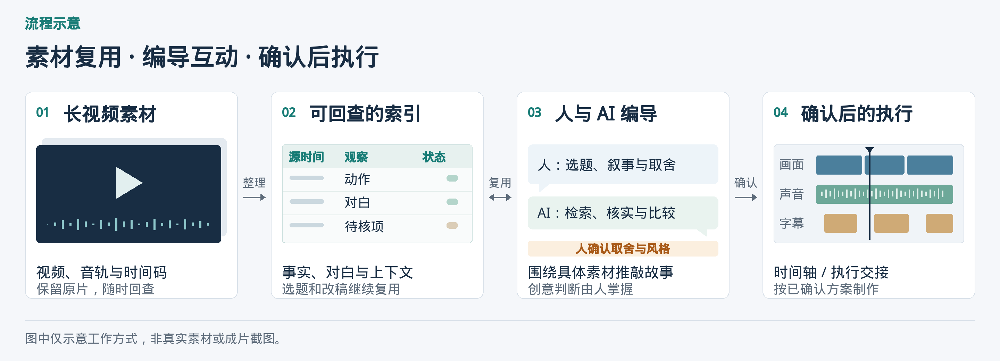

# Long Video Remix

**中文** | [English](README.en.md)

把长视频整理成可检索、可回查的素材索引，和 AI 一起找选题、推敲故事、反复改稿，再把确认的方案交给剪辑执行。



适合需要反复使用长视频素材、持续讨论创意、制作不同内容版本的 **MCN、编导与内容编辑**。

| 核心价值 | 怎么实现 |
|---|---|
| **低成本复用** | Broad 建全局内容地图；创意讨论、检索和改稿复用数据，Detail 集中核实被选区域 |
| **结构足够丰富** | 保留逐抽样帧事实、动作变化、对白 / 说话人依据、上下文、情绪线索、问题、未验证项和源时间 |
| **创意由人掌握** | 两次 Direct：先定“讲什么”，证据补齐后再定“具体怎么讲”；Execute 落实已确认决定 |
| **执行可检查** | 证据与源版本绑定、切点与对白保护、授权取段与顺序、时间轴校验、分层缓存和导出审计 |

目标是减少反复理解原始多模态素材的开销。抽帧、ASR、定向回看与 GPU 渲染仍需资源；具体成本取决于素材、模型和工具，本项目未承诺固定降幅。

请仅使用你有权使用的素材。

版本更新、校验结果与安装方式见 [更新说明](RELEASE_NOTES.md) · [CHANGELOG](CHANGELOG.md) · [安装与更新](INSTALL.md) · [历史 QA](docs/qa/README.md)。

## 快速开始

本地首次安装时，选择对应工具的一行命令；已有安装目录时见 [安装与更新](INSTALL.md)。

```sh
# Claude Code
mkdir -p ~/.claude/skills && git clone https://github.com/hazelliuliu1823-cloud/long-video-remix.git ~/.claude/skills/long-video-remix

# Codex
mkdir -p ~/.agents/skills && git clone https://github.com/hazelliuliu1823-cloud/long-video-remix.git ~/.agents/skills/long-video-remix
```

1. 安装完整文件夹，复制 `assets/project-template.json` 建立独立项目，登记源与可用模型 / 视频工具。
2. 完成 Broad 的正式观察层和 Content Map；只做结构化时可在此交付，后续剪辑可复用。
3. 人 / Director 定主线，Detail 核实命中区域并交付真实关键帧与独立 handoff，再由 Direct 2 确认 Execution Package（计划 + 制作 reference）和机器授权。
4. 执行静态校验与编译，渲染适配器在消费清单前检查授权：

```sh
python3 scripts/validate_project.py PROJECT
python3 scripts/compile_render_manifest.py PROJECT
python3 scripts/check_render_authorization.py PROJECT PROJECT/render-manifest.json
```

原始音画处理与实际渲染由当前环境的模型、视频 MCP、FFmpeg 或其他适配器完成。随包脚本提供授权记录准备、静态检查、时间轴编译和导出审计，渲染器按 [MCP 适配](references/mcp-adapter.md) 接入。

## 常用提问示例

把〔……〕替换成你的素材、主线或文件，按当前任务选用。

### 1. 还没有选题，先做 Broad Structure

**可以怎么问：**

> 请对〔视频素材〕做 Broad Structure，覆盖整段素材，建立可回查的结构化记录。交付逐抽样帧观察表、场景与动作索引、问题与未验证项、全片概览和 Content Map，注明已处理范围与缺口。本轮完成后停在 Broad 阶段。

**会拿到什么：** Broad 素材包，包括基础观察表、全片概览、Content Map 和覆盖记录；每条记录保留源素材与时间定位。

### 2. Broad 已完成，这批素材可以讲什么？

**可以怎么问：**

> 请基于〔Broad 素材包〕，提出少量有明显区别的创作方向。每个方向说明核心表达、叙事主线、对应素材区域、当前依据，以及需要 Detail 核实的问题，供我选择。

**会拿到什么：** 候选方向与第一轮 Direct 的主线草案。方向可由人或独立 AI Director 提出，讨论确认后用于定向精查。

### 3. 主线已确认，具体精查哪里？

**可以怎么问：**

> 已确认的主线是〔主线〕，必须保留的表达是〔重点〕。请从〔Broad 素材包〕中定位需要做 Detail Structure 的区间，逐项列出源视频、时间范围、选择原因、必要前后文和待核问题。本轮先交付精查任务单。

**会拿到什么：** 可直接交给精查环节的区间清单，每个区间说明为什么看、要核实什么；精确切点留到 Detail 核实。

### 4. 区间已选好，请完成 Detail 并交接

**可以怎么问：**

> 请按〔已确认主线〕和〔精查任务单〕，回到原片做 Detail Structure。核实完整画面、对白、说话人、动作及前后语境，区分事实、解释和未验证项；给出完整可剪单元、建议切点、安全切点范围、必须保留的对白与动作，以及剪辑风险。交付 Detail 证据表、真实关键帧和可独立阅读的 handoff，说明素材是否支持原主线。

**会拿到什么：** Detail 证据包，包括精查区间与深度观察、说话人核验、剪辑边界、真实关键帧和交接文件。交接文件写清下一轮 Direct 所需的执行包要求，未完成项明确标注。

## 工作路径

| 环节 | 产出与决定 |
|---|---|
| Broad Structure → Structured Observation Layer → Content Map | 全局观察表、场景 / 动作 / 问题索引，保留覆盖与缺口 |
| Direct 1 · Narrative Direction | 人 / Director 确定主线、候选区域和待核问题 |
| Directed Deep / Detail Structure + Edit Boundary | 核实连续音画、前后语境、反证和可剪范围；随证据交付真实关键帧与独立 handoff；证据不足返回 Direct 1 |
| Direct 2 · Execution Package | 确认计划 + 制作 reference：事件、顺序、具体声音 / 文字 / 转场、一两个风格样本的全片应用规则与允许调整 |
| Execute → Render / QA | 按完整执行包与机器授权制作，再完成技术检查、动态听看与 Reference Compliance |

## 丰富结构如何可靠进入执行

固定信息地板保留事实、派生解释与 unknowns；source-time 标签使每个判断能回原片；增量落盘和恢复减少重复扫描。执行完整性机制将采用的 evidence、boundary、review 和独立源音轨绑定当前素材版本，并对照 Direct 2 检查实际范围与顺序。

未就绪草稿只能显式用 `--planning` 编译为不可渲染清单。声音连续性检查保护对白与尾音，J/L-cut 或创作截尾必须有具体已确认依据。运行结果继续区分技术通过与最终听看验收。

工程字段与迁移见 [执行完整性契约](references/execution-integrity.md)；可运行示例见 `examples/synthetic-ready`（合成记录，无真实媒体）。同一结构层还可用于 [内容效果分析](examples/content-performance-analysis.md)。

<details>
<summary><strong>完整方法、Structure 表单、Direct 职责与工程说明</strong></summary>

## 为什么 Structure 值得单独做

视频、图片、字幕 / 原声、人物、动作、场景与上下文原本都是高成本的多模态信息。Structure 会把这些信息压成可检索、可排序、可回查的表格和文本层，例如 `frame-observations.csv`、scene / overview 与 `content-map.md`。后续的人、Director 或其他 Skill 可以优先消费这些紧凑数据，而不是每次重新加载原视频、九宫格和大量图片。

这带来一个很直接的变化：

| 过去 | Structure 之后 |
|---|---|
| 一条视频一条视频重新分析 | 把多条视频变成统一的结构化数据层 |
| 想看某个时间点，还要重新打开视频 | 直接定位到时间码对应的人物、动作、对白、背景和内容说明 |
| 不同任务要重复读取同一批多模态素材 | 剪辑、内容研究、效果复盘、检索可以复用同一套结构化结果 |
| 大量上下文消耗在“重新看一遍” | 高成本多模态读取集中到真正需要深挖的区域 |

## Execute 为什么同样是核心

Structure 解决“素材怎么看得清、怎么复用”，但最终要做成视频，还需要把已经确认的创意方案变成**保留证据与保护范围、可以渲染和核查**的时间轴。

Execute 负责把 Directed Deep Structure 已经核实过的素材继续收敛成：

- verified units 与必要前后文；
- `context_ranges` / `protected_ranges`，避免剪掉关键语义或动作；
- `edit-boundaries.csv`：把“内容结束”与“真正可切”分开，记录音频尾部、动作 / 反应收束、preferred in/out、safe windows、must-keep ranges 和 cut risk；
- assembly timeline 与 output timeline；
- hard cut / xfade、音轨、文字轨和章节卡；
- `render-manifest.json`；
- 导出后的完整解码、帧数 / 时长检查、近静音扫描、全部接点对照图与最终 QA。

因此，这个仓库不是“先结构化，后面交给你自己想办法剪”。**Structure 和 Execute 是两端的稳定能力，Direct 是两次需要人参与的创意决策点：先定主线，再定最终执行方案。**

## 一个最直观的例子：从“分析视频”到“分析内容”

假设你有 500 条已经发布的短视频，同时拿到了播放曲线、停留、跳出或互动数据。

过去通常只能先得到：

> 视频 A 在 12 秒留存上升；视频 B 在 8 秒开始流失；视频 C 完播率较高。

但真正想知道的是：**用户在那个时间点到底看到了什么。**

Structure 之后，每一个已分析时间点都可以对应到结构化内容：人物、动作、表情 / 视线、空间关系、对白、屏幕文字、场景背景和叙事功能。于是用户行为数据可以直接挂到内容节点上：

| 时间点 | 结构化内容 | 内容类型 | 用户表现 |
|---|---|---|---|
| 00:08 | 两人争执，其中一人转身离开 | 冲突 / 动作变化 | 留存上升 |
| 00:12 | 近景反应，无对白 | 人物反应 | 重播增加 |
| 00:19 | 长段解释性对白 | 信息说明 | 流失增加 |
| 00:27 | 前面埋下的信息得到兑现 | 情节兑现 | 留存再次上升 |

这时分析对象就不再只是“哪条视频表现好”，而可以进一步问：

- 哪一类画面更容易产生停留？
- 哪种人物动作经常对应重播？
- 用户流失前通常出现的是长对白、静态画面，还是信息密度下降？
- “冲突 → 反应 → 兑现”这样的结构在不同视频中表现是否稳定？
- 能不能直接找出所有“人物沉默 + 近景反应”的片段，再比较它们的表现？

**Structure 的价值，就是把视频从难以计算和组合的多模态对象，转换成可以检索、筛选、连接、比较和再次创作的数据层。**

同一套结构化结果，不只服务于剪辑，也可以继续用于内容复盘、用户行为分析、跨视频比较、研究、检索和其他 AI 工作流。更完整的示例见 [`examples/content-performance-analysis.md`](examples/content-performance-analysis.md)。

## 适用场景

这套方法适合任何“素材很长、需要反复理解和再利用”的视频工作：剧情 / 综艺 / 访谈 / 纪录片 / 课程 / 活动录像，以及已经发布内容的效果复盘。

它尤其适合以下情况：

- 素材多到无法靠一次摘要可靠理解；
- 同一批视频会被反复用于剪辑、研究、检索或分析；
- 创意方向需要人参与，而不是交给黑箱一次生成；
- 只有少量候选片段值得投入高密度多模态观察；
- 最终还需要把内容判断落实成稳定的时间轴、转场、音轨和 QA。

## 为什么是两轮 Structure

一次把整部长视频扫到帧级既昂贵，也容易在创意方向尚未确定时浪费计算。这里采用两轮不同目标的 Structure：

- **第一轮 Broad Structure：覆盖优先。** 用较低密度看完整素材，并把结果压成可复用的结构化工作层；
- **第二轮 Directed Deep Structure：完整度优先。** 脚本方向确认后，只回到命中的区域补高密度画面、原声、前后语境和反证。

因此，真正昂贵的多模态观察集中在少量高价值区域；而创意讨论、检索和跨视频分析可以尽量基于已经结构化的数据进行。

## Structure 是可复用的工作层

这层结构化数据并不是为了替代原始证据，而是为了让后续工作不必每次从原视频重新开始。它可以被人和其他模型快速浏览、过滤、排序、搜索和引用。

它主要解决三个问题：

- **减少重复多模态读取**：后续 Direct 不需要为了每次创意讨论都重新把原视频、九宫格或大量图片塞进上下文；
- **降低创意阶段的上下文负担**：人工、Director 或其他 Skill 可以直接在 `frame-observations.csv`、scene / overview 和 `content-map.md` 上做组合与判断；
- **把高成本计算集中到命中区域**：只有确认脚本涉及的段落才回到原片进入 Directed Deep Structure，高密度读取画面、原声和前后语境。

这不是把原始证据丢掉。所有结构化记录仍保留 `frame_id`、`scene_id`、时间码、evidence refs 等回查路径，需要时可以重新落回原素材。

## Structure 能做什么

Broad Structure 允许在还没有明确选题时启动。典型产物包括：

- 源素材与版本登记；
- 全时段画面抽样与字幕 / 转写覆盖；
- **Frame Observation Index**：每个已分析抽样帧一行，保留帧号 / 时间 / 帧尾 ms、画面事实、动作 / 状态、情绪线索、空间 / 背景、意象标签、硬字幕、**原声要点与核听状态**、内容说明、与前帧变化、**topic judgment、confidence / evidence basis**、interpretations 与 unknowns；
- **Action Node Candidates**：对动作、视线、站位、物件交接等变化候选建立默认 4fps 的局部加密窗口，并保留候选起止、最小有效单元、口型 / 说话线索和关系转折；
- **Structure Q&A**：把会影响理解的问题、回答、证据、未验证项与下一步核查结构化保存；
- scene 级事件结构；
- 可回查的对白、人物、地点和动作证据；
- source-order overview；
- 跨场景的 Content Map；
- 关系变化、重复线索、关键物件、无声互动等导航；
- coverage 与 unknowns，明确哪些地方只是抽样、哪些已经连续音画核实。

Structure 的目标不是“总结剧情”，而是把原本难以浏览的长视频变成一个**人和模型都能重新检索、组合和回查的素材空间**。

因此 Broad Structure 的正式交付不是“九宫格 + 一个总结”，也不是只交一个 Content Map，而是一套**文字化、结构化、可检索、可回查的工作数据包**：

1. **Raw evidence**：抽样单帧、九宫格、字幕 / ASR、原始定位；
2. **Structured Observation Layer（核心交付）**：`frames.jsonl` + 人可读的 `frame-observations.csv`、`action-node-candidates.csv`、`structure-questions.csv`，以及 scene / segment 级观察与 `overview.md`；
3. **Creative navigation layer**：在上述正式表单之上形成 `content-map.md`、情绪 / 关系线索与可用边界，供第一次 Director 在不重新加载原视频的情况下确定 Narrative Direction。

这里的逐帧指 **each analyzed / sampled frame**，不是声称对 25/30fps 的每一个视频帧都做了语义分析。

`deliverable=content_map` 时，可以在这一阶段正式结束，不必进入剪辑。

### Structure 的最低信息地板

Structure 输出不能退化成“几句总结 + 一个 Content Map”。基础观察层是后续创意、分析和 Execute 的共同底座：

- 每个已分析 sampled frame 必须保留一行结构化记录；
- `visual_facts`、动作 / 状态、`motif_tags`、硬字幕 / 可见文字、`change_from_previous`、`content_description`、`unknowns` 必须显式填写；没有内容也写 `none` / `unknown` / `not_applicable`；
- 动作变化候选必须进入独立的 action-node 表并带 4fps 局部窗口或明确例外原因；
- 会影响理解的问题必须进入 Q&A 表，保留证据和未验证项；
- overview、Content Map、最终文案或剪辑建议只能建立在这些基础记录之上，不能替代它们。

这条约束的目的，是保证 Structure 真正成为可复用的数据层，而不是每次任务结束后只留下一个无法下钻的总结。

## Direct 为什么分两次

Direct 默认由外部完成，而且通常适合在一个**独立的研究 / 编导工作区**里完成。它不是一次性把“选题、证据核实、最终剪辑方案”全混在一起，而是分别出现在两轮 Structure 的两侧。

### Direct 1：Narrative Direction — “到底讲什么？”

第一次 Director 消费的是 Broad Structure 的正式文字化结构数据：逐抽样帧 / 分片段观察、动作节点、Q&A、scene / overview、Content Map、情绪 / 关系线索、可用素材边界，以及必要的外部研究。它的任务是抽选：

- 核心命题 / 观看关系；
- Narrative Spine；
- candidate regions / scenes；
- 希望 Detail Structure 回答的问题；
- 已确认的人工判断与禁改项。

这一步**不要求精确切点，也不应把结构化线索提前写成已验证事实**。可使用 `assets/narrative-direction-template.md`，也可以直接接入已有研究 / 编导文档。

### Direct 2：Execution Package — “这些材料最终怎么讲？”

Directed Deep / Detail Structure 完成后，Director 第二次接收的是完整证据包：deep observations、原声 / 硬字幕核验、说话人裁决、context / counterevidence、verified units、protected ranges 与 evidence gaps。此时才形成最终执行包，其中 Editorial Execution Plan 包括：

- 最终选择 / 排除哪些 verified units；
- 顺序和每段叙事功能；
- 必须完整保留的对白 / 动作 / 反应；
- 声音、文字、转场、节奏与时长分配；
- 可替换范围和不得改变的核心表达。

同时交付 `execution-reference.md`：实际文字样式 / 位置 / 停留、画面处理、声音 / 转场、资源与 QA 判据；通常一两个样本即可锁定全片风格，不要求每个镜头 / 字幕逐项对应。Detail 的 handoff 已直接携带这套输出要求，换模型无需依赖安装环境。详见 [完整交付契约](references/execution-package.md)。可使用 `assets/execution-plan-template.md` 和 `assets/execution-reference-template.md`。`assets/editorial-plan-template.md` 保留为兼容旧项目的合并式模板。Execute 默认只落实这个第二次 Director 已确认的方案；**最终素材取舍属于 Direct 2，不属于 Execute。** 如果核心 evidence 仍是 `pending / contradicted`，或两次 Direct 尚未确认，时间轴不能标为 `ready_for_render`。

## Directed Deep Structure 为什么单独存在

第一次 Content Map 不应该为了某个主题把所有区域都扫描到帧级；那会非常昂贵，也会让 Structure 变成提前押题。

有了第一次 Direct 的 Narrative Direction 后，系统才知道应该在哪些区域增加信息密度。第二轮仍然先做**完整素材理解**，再做剪辑判断，而不是找到候选后马上标切点。典型动作包括：

- 从十秒级概览抽样提高到一秒一至两张或连续播放；动作 / 视线 / 站位等关键变化节点继续使用默认 4fps 局部窗口加密观察；
- 先建立 **Detail Interval Card**：写清为什么进入精查、前情、当前背景、后续、目标问题和主题关联；
- 对选中的核心区域建立 **Deep Observation Index**，记录完整画面描述：人物、站位 / 朝向、动作链、关键视觉变化、可观察情绪线索 / 谨慎情绪解释、表情 / 视线、人物间距离、关键物件、意象标签、景别 / 构图；
- 补充**内容描述**：这一小段实际发生了什么，而不是只抄关键词或台词；
- 补充**场景背景与叙事背景**：地点 / 时间 / 环境、前一事件、为什么会来到这一刻；
- 从字幕关键词回到整段对话核听，区分硬字幕 / ASR / 真实原声，记录说话人、对象、语气、停顿、环境声 / 音乐和 audio_verified；有歧义时用 **Speaker Adjudication** 做帧级口型 / 原声 / 字幕 / ASR 裁决；
- 从单个场景扩到前后十五至三十秒，必要时继续扩到完整事件，记录 before_state / after_state；
- facts、interpretations、unknowns 分开，保留 `question_refs` / 未验证项，并检查 Narrative Direction 的反证、缺口、错误因果和时空关系；
- 最后才把已充分理解的核心区域收敛为 unit、context_ranges、protected_ranges 和可执行剪辑判断。

如果证据与 Narrative Direction 冲突，工具应报告问题并返回 Direct 1 调整；如果证据成立，则把 Detailed Structure 的完整证据包交回 Director，形成第二次 Direct 的 Execution Package（Editorial Execution Plan + 制作 reference），再进入 Execute。

## Execute 能做什么

进入 Execute 时，创意方向已经确定，相关素材也经过第二轮定向深挖。后续工作包括：

- 形成可执行 edit plan；
- 建立 assembly timeline 与 output timeline；
- 处理 hard cut / xfade、音轨、文字轨、章节卡；
- 使用 `protected_ranges` 防止剪掉必要语义和动作；
- source event 按累计时长统一量化到目标 fps，validator 与 compiler 共用同一套 output 坐标计算，避免逐段四舍五入累积漂移；
- `source.time_mapping` 进入精确缓存身份，映射变化会使相关视频 / 音频 / final 缓存失效；
- 编译 `render-manifest.json`；
- 分层缓存视频、音频和文字产物；
- 导出后完整解码、核对帧数和展示时长；
- 扫描近静音；
- 自动生成全部接点对照图；
- 区分技术检查、动态听看和最终成片验收。

当前仓库提供时间轴编译与导出审计脚本，但**不绑定唯一渲染器**。你可以把 `render-manifest.json` 交给 FFmpeg、视频 MCP、剪辑软件适配器或自己的渲染流程。

## 主要文件

```text
long-video-remix/
├── README.md
├── README.en.md
├── CHANGELOG.md
├── INSTALL.md
├── RELEASE_NOTES.md
├── LICENSE
├── SHA256SUMS
├── SKILL.md
├── agents/
│   └── openai.yaml
├── assets/
│   ├── icon.svg
│   ├── workflow-overview.zh.png
│   ├── workflow-overview.en.png
│   ├── frame-observation-template.csv
│   ├── deep-observation-template.csv
│   ├── edit-boundary-template.csv
│   ├── detail-interval-template.csv
│   ├── speaker-adjudication-template.csv
│   ├── action-node-candidate-template.csv
│   ├── structure-question-template.csv
│   ├── content-map-template.md
│   ├── brief-template.md
│   ├── narrative-direction-template.md
│   ├── execution-plan-template.md
│   ├── execution-reference-template.md
│   ├── execution-handoff-template.md
│   ├── keyframe-reference-template.json
│   ├── structure-exception-template.json
│   ├── editorial-plan-template.md
│   ├── execution-authorization-template.json
│   ├── project-template.json
│   └── timeline-template.json
├── docs/
│   └── qa/
│       ├── README.md
│       ├── v1.0.3-QA.md
│       ├── v1.0.3-QA.json
│       ├── v1.0.4-QA.md
│       ├── v1.0.4-QA.json
│       ├── v1.0.5-QA.md
│       ├── v1.0.5-QA.json
│       ├── v1.0.6-QA.md
│       └── v1.0.6-QA.json
├── examples/
│   ├── content-performance-analysis.md
│   └── synthetic-ready/
├── references/
│   ├── workflow.md
│   ├── data-contracts.md
│   ├── execution-integrity.md
│   ├── execution-package.md
│   ├── montage-rules.md
│   ├── render-engineering.md
│   ├── qa-handoff.md
│   ├── regression-checklist.md
│   ├── structure-regression-matrix.md
│   ├── mcp-adapter.md
│   └── worked-example.md
├── tests/
│   ├── test_dialogue_continuity.py
│   ├── test_execution_integrity.py
│   ├── test_execution_package.py
│   ├── test_independent_audio_dialogue.py
│   └── fixtures/ready-project.json
└── scripts/
    ├── validate_project.py
    ├── compile_render_manifest.py
    ├── timeline_math.py
    ├── execution_integrity.py
    ├── prepare_execution_authorization.py
    ├── check_render_authorization.py
    └── audit_render.py
```

## 最小使用方式

### 只做 Structure

1. 复制 `assets/project-template.json` 为项目目录中的 `project.json`；
2. 登记 sources 和实际可用工具；
3. 完成 Broad Structure，并同时保留 `frames.jsonl` 与人可读的 `frame-observations.csv`（可复制 `assets/frame-observation-template.csv`）；动作变化候选进入 `action-node-candidates.csv`（默认 4fps 局部窗口），结构化问题 / 回答 / 未验证项进入 `structure-questions.csv`；
4. 在逐抽样帧观察之上形成 scene / `overview.md` / `content-map.md`，可参考 `assets/content-map-template.md`；
5. 将 `project.deliverable` 设为 `content_map` 即可在这里交付。

### 做完整 Remix

1. 先完成 Broad Structure，交付正式的 Structured Observation Layer + Content Map；
2. 由人 / Director 基于这些文字化结构数据和必要外部研究形成 Narrative Direction（Narrative Spine + candidate regions + verification questions）；
3. 把 Narrative Direction 接回项目，对命中区域进行 Directed Deep / Detail Structure，并生成 `deep-observations.csv`，把核心区域的画面、内容、背景、前后状态、原声证据、反证和保护范围补全；
4. 交付真实关键帧、证据与独立 handoff（含下游完整输出要求），交回 Director 形成 Execution Package；
5. Execute 只依据已确认计划 + 制作 reference，把 verified units / protected ranges 编译为 edit plan 和 timeline，按冻结样式制作；
6. 先按 [执行完整性契约](references/execution-integrity.md) 保存当前证据绑定和 Direct 2 的机器授权，再运行：

```text
python3 scripts/validate_project.py 项目目录
python3 scripts/compile_render_manifest.py 项目目录
python3 scripts/check_render_authorization.py 项目目录 项目目录/render-manifest.json
```

7. 使用实际渲染器生成视频后运行：

```text
python3 scripts/audit_render.py 成片.mp4 项目目录/render-manifest.json --outdir 核查目录 --contacts
```

## 边界

- 抽帧负责发现，不等于连续观看；
- 字幕 / ASR 负责检索，不等于核听原声；
- Broad Structure 的正式表单是文字化结构数据，Content Map 建立在其上，不能反向替代表单；
- Direct 1 的 Narrative Direction 是编导意图，不等于已经得到素材证明；
- Directed Deep Structure 负责把 Narrative Direction 重新压回原片证据；
- Direct 2 基于核实后的证据与关键帧形成完整 Execution Package；Execute 不默认跨过这一步自行决定最终讲法或风格；
- 工具可以建议某个节点的素材不足或替代片段，但默认不擅自改写已经确认的核心表达；
- 渲染成功日志不等于成片通过验收。

## 当前状态

这套仓库更接近一个 **AI-native long-video analysis + remix execution framework**，而不是自动生成短视频的一键工具。

它最适合放在“内容理解”和“实际剪辑工程”之间：先把长素材变得看得见，再把人的创意可靠地做出来。

## License

MIT License。你可以使用、修改和再分发本项目；保留原始版权与许可声明即可。详见 `LICENSE`。

</details>
